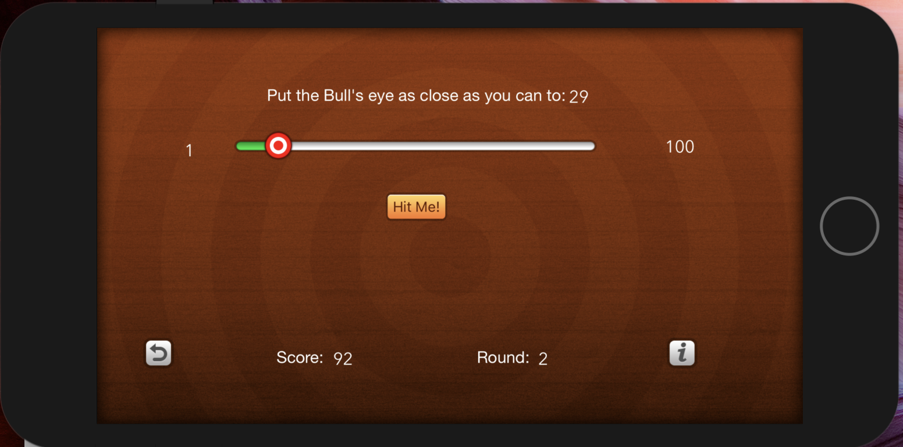

# Bullseye
## Description
Bullseye is a single player game that allows the user to visually try and get as close to the number as possible.  The player scores points and gets an additional 100 points if they hit the number exactly.
## Technologies used
- UIKit
- Swift
- image View
- custom view controllers for about and author section
- custom slider
## Key features
- reset score
- information button to learn about game
- information button to learn about Author
- scoring system for player that adds score with bonus points when exact 
## setup
- use terminal and git clone to your desktop
- open in xcode
## Author
&copy; 2018 Jonathan Cochran
## Legal
Application is licensed under MIT License for open source software
## ScreenShot of app

